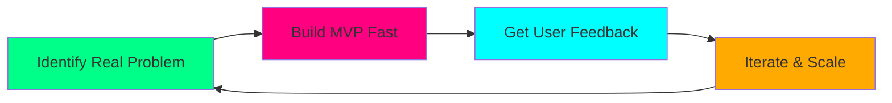
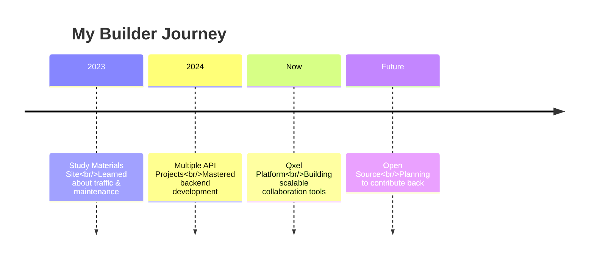

<style>
  @keyframes float {
    0%, 100% { transform: translateY(0px); }
    50% { transform: translateY(-10px); }
  }
  
  @keyframes glow {
    0%, 100% { text-shadow: 0 0 10px #00ff88, 0 0 20px #00ff88; }
    50% { text-shadow: 0 0 20px #ff0080, 0 0 30px #ff0080; }
  }
  
  @keyframes typewriter {
    from { width: 0; }
    to { width: 100%; }
  }
  
  @keyframes fadeIn {
    from { opacity: 0; transform: translateY(20px); }
    to { opacity: 1; transform: translateY(0); }
  }
  
  @keyframes rotate3D {
    0% { transform: rotateY(0deg) rotateX(0deg); }
    100% { transform: rotateY(360deg) rotateX(360deg); }
  }
  
  .floating { animation: float 3s ease-in-out infinite; }
  .glowing { animation: glow 2s ease-in-out infinite; }
  .typewriter { 
    overflow: hidden;
    border-right: .15em solid #00ff88;
    white-space: nowrap;
    animation: typewriter 3s steps(40) 1s both, blink-caret .75s step-end infinite;
  }
  .fade-in { animation: fadeIn 1s ease-out; }
  .rotate-3d { animation: rotate3D 10s linear infinite; }
  
  @keyframes blink-caret {
    from, to { border-color: transparent; }
    50% { border-color: #00ff88; }
  }
  
  .tech-icon {
    display: inline-block;
    transition: all 0.3s ease;
    font-size: 2.5rem;
    margin: 10px;
  }
  
  .tech-icon:hover {
    transform: scale(1.5) rotate(15deg);
    filter: drop-shadow(0 0 10px #ff0080);
  }
  
  .project-card {
    background: linear-gradient(145deg, #1a1a1a, #2d2d2d);
    border-radius: 15px;
    padding: 20px;
    margin: 15px 0;
    border-left: 4px solid #00ff88;
    transition: all 0.3s ease;
  }
  
  .project-card:hover {
    transform: translateX(10px);
    border-left: 4px solid #ff0080;
    box-shadow: 0 10px 30px rgba(0, 255, 136, 0.2);
  }
  
  .pulse-dot {
    display: inline-block;
    width: 10px;
    height: 10px;
    border-radius: 50%;
    background: #00ff88;
    animation: pulse 1.5s infinite;
  }
  
  @keyframes pulse {
    0% { transform: scale(1); opacity: 1; }
    50% { transform: scale(2); opacity: 0.5; }
    100% { transform: scale(1); opacity: 1; }
  }
</style>

<div align="center">

<!-- Main Header with Custom Animation -->
<h1 class="glowing" style="font-size: 3rem; margin-bottom: 0;">
  ⚡ SHAMEEM ⚡
</h1>

<!-- Floating Avatar -->
<div class="floating" style="font-size: 5rem; margin: 20px 0;">
  🚀
</div>

<!-- Typewriter Effect -->
<h2 class="typewriter" style="font-size: 1.8rem; margin: 20px auto; width: fit-content;">
  Full-Stack Developer & Product Builder
</h2>

<!-- Animated Status -->
<div class="fade-in" style="margin: 30px 0;">
  <span class="pulse-dot"></span>
  <strong>Currently Building:</strong> 
  <span style="color: #00ff88;">Qxel Platform</span>
  <span class="pulse-dot"></span>
</div>

</div>

---

## 🎯 What I Do

<div class="fade-in" style="animation-delay: 0.5s;">

const shameem = {
  code: ["JavaScript", "TypeScript", "Python", "Java"],
  tech: {
    frontend: ["React", "Next.js", "Tailwind", "Vue"],
    backend: ["Node.js", "Express", "FastAPI", "Spring"],
    database: ["MongoDB", "PostgreSQL", "Redis"],
    devops: ["Docker", "AWS", "Vercel", "NGINX"]
  },
  architecture: ["Microservices", "Serverless", "MVP Development"],
  currentFocus: "Building scalable platforms with great UX",
  philosophy: "Ship fast, iterate faster"
};
</div>

---

## 🛠️ Tech Arsenal

<div align="center" class="fade-in" style="animation-delay: 1s;">

<!-- Animated Tech Icons -->
<div style="display: grid; grid-template-columns: repeat(auto-fit, minmax(80px, 1fr)); gap: 20px; margin: 30px 0;">

<div class="tech-icon" title="JavaScript">🟨</div>
<div class="tech-icon" title="React">⚛️</div>
<div class="tech-icon" title="Node.js">🟢</div>
<div class="tech-icon" title="Python">🐍</div>
<div class="tech-icon" title="TypeScript">🔷</div>
<div class="tech-icon" title="MongoDB">🍃</div>
<div class="tech-icon" title="Docker">🐳</div>
<div class="tech-icon" title="AWS">☁️</div>

</div>

</div>

---

## 🔥 Current Projects

<div class="fade-in" style="animation-delay: 1.5s;">

### 🚀 Qxel Platform
<div class="project-card">
**Revolutionizing how teams collaborate**  
- **Status:** Active Development  
- **Tech:** Next.js, Node.js, MongoDB, WebSockets  
- **Focus:** Real-time collaboration features  
- **Private Repository** 🔒
</div>

### 📚 Manglish Dictionary API
<div class="project-card">
**Malayalam-English hybrid language tool**  
- **Status:** Planning Phase  
- **Tech:** FastAPI, PostgreSQL, Redis  
- **Focus:** Language processing and API design  
- **Open Source Soon** 📦
</div>

### 💡 Study Materials Platform
<div class="project-card">
**Learning from past experiences**  
- **Status:** Completed (Learning Experience)  
- **Key Takeaways:** Traffic generation, maintenance optimization  
- **Focus:** Applied lessons to current projects  
- **Archived** 📚
</div>

</div>

---

## 🎨 My Development Philosophy

<div class="fade-in" style="animation-delay: 2s;">



</div>

<div style="display: grid; grid-template-columns: repeat(auto-fit, minmax(250px, 1fr)); gap: 20px; margin: 30px 0;">

<div style="padding: 20px; background: rgba(0, 255, 136, 0.1); border-radius: 10px;">
<h4>🚀 Ship Fast</h4>
<p>Better to have a working prototype than a perfect plan</p>
</div>

<div style="padding: 20px; background: rgba(255, 0, 128, 0.1); border-radius: 10px;">
<h4>🎯 Solve Real Problems</h4>
<p>Focus on user pain points, not just cool tech</p>
</div>

<div style="padding: 20px; background: rgba(0, 255, 255, 0.1); border-radius: 10px;">
<h4>📈 Learn & Iterate</h4>
<p>Every project teaches something valuable</p>
</div>

</div>

---

## 📈 Project Timeline

<div class="fade-in" style="animation-delay: 2.5s;">



</div>

---

## 🤝 Let's Build Together

<div align="center" class="fade-in" style="animation-delay: 3s;">

<!-- Animated Contact Links -->
<div style="display: flex; justify-content: center; gap: 15px; flex-wrap: wrap; margin: 30px 0;">

[](mailto:your.email@example.com)
[](https://linkedin.com/in/yourprofile)
[](https://yourportfolio.com)

</div>

<!-- Floating message -->
<div class="floating" style="margin: 40px 0;">
  <strong>Open to:</strong> 
  <span style="color: #00ff88;">Collaborations</span> • 
  <span style="color: #ff0080;">Interesting Projects</span> • 
  <span style="color: #00ffff;">Tech Discussions</span>
</div>

</div>

---

<div align="center" style="margin-top: 50px;">

<!-- Rotating emoji -->
<div class="rotate-3d" style="font-size: 2rem; margin: 20px 0;">
  ⚡✨🚀
</div>

*"I don't build for stats; I build for impact."*  
**Thanks for stopping by!** 👋

<!-- Snake border animation -->
<div style="height: 3px; background: linear-gradient(90deg, #00ff88, #ff0080, #00ffff, #00ff88); background-size: 400% 400%; animation: gradient 3s ease infinite;"></div>

<style>
@keyframes gradient {
  0% { background-position: 0% 50%; }
  50% { background-position: 100% 50%; }
  100% { background-position: 0% 50%; }
}
</style>

</div>
```
